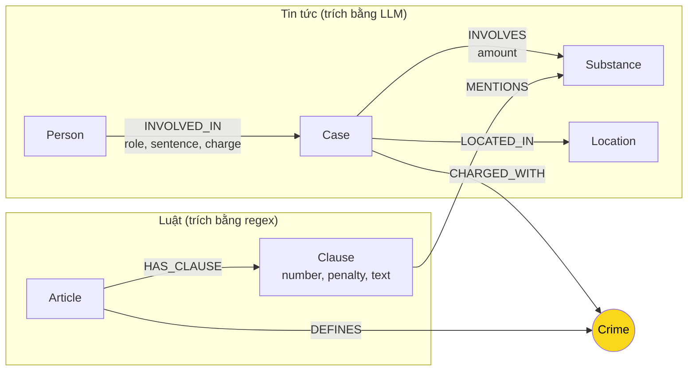

# Thiết kế Ontology — Day 19

**Họ tên:** Đỗ Việt Hoàng  **MSSV:** 2A202602882

**Lựa chọn** (đánh dấu một):
- [x] Dùng ontology gợi ý (có thể chỉnh nhỏ)
- [ ] Tự thiết kế (xét bonus +15, xem `SUBMISSION.md`)

> Hướng dẫn: `LAB_GUIDE.md` Bước 2. Dùng ontology gợi ý thì vẫn phải điền đủ các mục dưới đây bằng lời của bạn.

## 1. Sơ đồ

Vẽ bằng mermaid (hoặc chèn ảnh `report/img/ontology.png`). Đánh dấu rõ **node cầu nối**.

**Node cầu nối:** `Crime` (tội danh) — được tô vàng trong sơ đồ. Luật định nghĩa tội qua `DEFINES`, vụ án trong tin bị truy tố tội đó qua `CHARGED_WITH`.

**Danh sách chất chuẩn (`SUBSTANCES` trong code):** Heroine, Cocaine, Methamphetamine, Amphetamine, MDMA, XLR-11, Ketamine, "cần sa", "thuốc phiện", "côca". Hàm `find_substances()` dùng list này để trích xuất từ văn bản luật; prompt LLM cũng nhận list này cho tin tức.

## 2. Entity types (node labels)

| Label | Ý nghĩa | Khóa định danh (`MERGE` theo) | Properties | Lấy từ KB nào | Trích bằng (regex / LLM / khác) |
| --- | --- | --- | --- | --- | --- |
| `Article` | Một Điều luật (ví dụ: Điều 251 BLHS) | `id` = "Điều 251 BLHS" | `id`, `title`, `law` (BLHS/PCMT) | Luật | Regex (`parse_law_article`) |
| `Clause` | Một khoản trong Điều luật | `id` = "Điều 251 BLHS khoản 1" | `id`, `number`, `penalty`, `text`, `article_id` | Luật | Regex (`parse_law_article`) |
| `Crime` | Tội danh chuẩn hóa (cầu nối) | `name` = tên chuẩn (vd: "mua bán trái phép chất ma túy") | `name` | Luật (tên Điều), News (LLM trích xuất + `link_entity`) | Regex từ tiêu đề Điều (luật), LLM + `link_entity` (tin) |
| `Substance` | Chất ma túy / tiền chất | `name` = tên chuẩn (vd: "MDMA", "Heroine") | `name`, `aliases` (danh sách tên khác) | Cả hai | Regex từ điểm khoản (luật dùng `SUBSTANCES` list), LLM (tin) |
| `Case` | Một vụ án cụ thể | `name` = tên do LLM đặt (vd: "Vụ Lê Minh Thành mua bán ma túy") | `name`, `summary`, `doc_id` | Tin tức | LLM (`extract_news_cases`) |
| `Person` | Bị cáo / liên quan | `name` = tên do LLM đặt | `name`, `doc_id` | Tin tức | LLM (`extract_news_cases`) |
| `Location` | Địa điểm vụ án | `name` = tên địa điểm | `name`, `doc_id` | Tin tức | LLM (`extract_news_cases`) |

## 3. Relationships

| Type | Từ → Đến | Properties trên cạnh | Ý nghĩa |
| --- | --- | --- | --- |
| `DEFINES` | `Article` → `Crime` | - | Điều luật định nghĩa tội danh này |
| `HAS_CLAUSE` | `Article` → `Clause` | - | Điều bao gồm các khoản |
| `MENTIONS` | `Clause` → `Substance` | `threshold` (chuỗi mô tả ngưỡng, vd: "từ 05 gam đến dưới 30 gam") | Khoản luật nhắc đến chất này với ngưỡng khối lượng |
| `CHARGED_WITH` | `Case` → `Crime` | - | Vụ án bị truy tố tội danh này |
| `INVOLVED_IN` | `Person` → `Case` | `role` (chủ phạm/đồng phạm), `sentence` (mức án), `charge` (tội danh gốc trong báo) | Người tham gia vụ án |
| `INVOLVES` | `Case` → `Substance` | `amount` (khối lượng trong vụ án) | Vụ án liên quan chất này với khối lượng cụ thể |
| `LOCATED_IN` | `Case` → `Location` | - | Vụ án xảy ra tại địa điểm này |

## 4. Node cầu nối giữa 2 KB

- **Node nào:** `Crime` (tội danh)
- **Vì sao chọn node này:** 
  - Luật định nghĩa tội danh rõ ràng trong tiêu đề từng Điều (ví dụ: "Tội mua bán trái phép chất ma túy" tại Điều 251)
  - Tin tức luôn nêu tội danh bị cáo bị truy tố/xét xử
  - Là thực thể ổn định nhất để nối: một tội danh chỉ được định nghĩa bởi một Điều, nhưng có thể xuất hiện trong nhiều vụ án
- **Cách đảm bảo hai phía khớp tên:**
  1. Từ luật: chuẩn hóa tên tội từ tiêu đề Điều bằng `normalize_crime()` (bỏ "Tội", lowercase, chuẩn hóa dấu "tuý/túy")
  2. Từ tin: LLM trích xuất tội danh gốc → đưa qua `link_entity(name, known_crimes, normalize=normalize_crime)` để map về tên chuẩn trong `known_crimes` (danh sách từ luật)
  3. `link_entity` dùng `difflib.get_close_matches(cutoff=0.8)` để khớp mờ khi LLM ghi khác (hoa/thường, có/bỏ "Tội", sai dấu)
- **Khi nào cầu gãy, và bạn xử lý thế nào:**
  - Gãy khi: LLM trích tội danh quá sai lệch (vd: ghi "buôn bán ma túy" thay vì "mua bán trái phép chất ma túy") → `link_entity` trả `None`
  - Gãy khi: Tin nhắc tội danh không có trong 18 Điều luật (ví dụ tội "tàng trữ" Điều 252 nhưng luật không có trong KB)
  - Xử lý: Vẫn tạo node `Case`, `Person`, `Substance` nhưng **không** tạo `CHARGED_WITH` đến `Crime`. Khi query KG-3, nếu không tìm thấy đường qua `Crime`, fallback về vector search (Flat RAG) — GraphRAG không bao giờ kém hơn Flat RAG.

## 5. Competency questions

Với mỗi câu trong `data/benchmark_kg.json`, ghi đường đi trên graph dùng để trả lời. Câu nào không trả lời được thì ghi rõ lý do.

| Câu | Đường đi (Cypher pattern) | Trả lời được? |
| --- | --- | --- |
| Q1 | `(:Article {law:"Luật PCMT", article:"Điều 2"})-[:HAS_CLAUSE]->(:Clause {number:2})` → lấy `Clause.text` chứa định nghĩa "Tiền chất" | ✅ Có (single-hop-law, chỉ cần KB luật) |
| Q2 | `(:Person {name:"Trần Thanh Tuấn"})-[:INVOLVED_IN]->(:Case)-[:INVOLVES]->(:Substance)` + filter `sentence` chứa "tử hình" | ✅ Có (single-hop-news, chỉ cần KB tin) |
| Q3 | `(:Person {name:"Lê Minh Thành"})-[:INVOLVED_IN]->(k:Case)-[:CHARGED_WITH]->(c:Crime)<-[:DEFINES]-(a:Article)-[:HAS_CLAUSE]->(cl:Clause {number:1})` → lấy `c.name`, `a.id`, `cl.penalty` | ✅ Có (cross-kb, đường đi đầy đủ qua cầu nối `Crime`) |
| Q4 | `(:Person)-[:INVOLVED_IN]->(:Case)-[:CHARGED_WITH]->(:Crime {name:"tổ chức sử dụng trái phép chất ma túy"})<-[:DEFINES]-(:Article {id:"Điều 255 BLHS"})-[:HAS_CLAUSE]->(:Clause {number:4})` → lấy `Clause.penalty` | ✅ Có (cross-kb, cần clause 4 cho khung cao nhất) |
| Q5 | `(:Person {name:"Cái Quang Huy"})-[:INVOLVED_IN]->(k:Case)-[:INVOLVES]->(:Substance {name:"MDMA"})` AND `k-[:CHARGED_WITH]->(:Crime)<-[:DEFINES]-(:Article {id:"Điều 250 BLHS"})-[:HAS_CLAUSE]->(cl:Clause)` → lọc clause có `MENTIONS` MDMA với ngưỡng ≥100g (khoản 4) | ✅ Có (cross-kb-multi-hop, cần lọc clause theo substance + ngưỡng) |
| Q6 | `(:Substance {name:"MDMA"})<-[:INVOLVES]-(:Case)<-[:INVOLVED_IN]-(:Person)` → collect distinct `Case.name`, `Person.name` | ✅ Có (aggregation, chỉ cần KB tin + node `Substance` dùng chung) |

**Lưu ý:** Tất cả 6 câu đều trả lời được với ontology này. Q1 và Q2 chỉ cần 1 KB, Q3-Q5 cần đi xuyên 2 KB qua node `Crime`, Q6 chỉ cần KB tin nhưng tận dụng `Substance` là node dùng chung.

## 6. Quyết định thiết kế và đánh đổi

Ít nhất 3 quyết định. Mỗi quyết định ghi: đã chọn gì, phương án khác là gì, vì sao chọn.

1. **Quyết định: Tách `Clause` thành node riêng thay vì gộp property vào `Article`**
   - *Đã chọn:* Mỗi khoản là một node `Clause` với property `number`, `penalty`, `text`, quan hệ `HAS_CLAUSE` từ `Article`.
   - *Phương án khác:* Gộp toàn bộ khoản vào property `clauses` của `Article` (danh sách JSON).
   - *Vì sao chọn:* Cần lọc khoản theo số (khoản 1 vs khoản 4) và theo `MENTIONS` substance. Tách node cho phép Cypher filter trực tiếp trên graph (`WHERE cl.number = 1`, `EXISTS { (cl)-[:MENTIONS]->(:Substance {name:"MDMA"}) }`), nhanh và tự nhiên hơn so với parse JSON trong application code. Đánh đổi: graph to hơn, nhiều node/edge hơn.

2. **Quyết định: `MENTIONS` từ `Clause` đến `Substance` mang property `threshold` (chuỗi ngưỡng khối lượng)**
   - *Đã chọn:* Property `threshold` trên cạnh `MENTIONS` lưu chuỗi mô tả ngưỡng (vd: "từ 05 gam đến dưới 30 gam").
   - *Phương án khác:* Tách thành node `Threshold` riêng với property `min_amount`, `max_amount`, `unit`; hoặc parse thành 2 property số `min_g`, `max_g` trên cạnh.
   - *Vì sao chọn:* Văn bản luật có nhiều đơn vị khác nhau (gam, kilôgam, mililít) và cú pháp phức tạp ("tương đương với..."). Parse chính xác sang số phức tạp, dễ sai. Giữ nguyên chuỗi văn bản gốc đảm bảo không mất thông tin, LLM đọc hiểu được khi đưa vào prompt. Đánh đổi: không thể so sánh số học trực tiếp trong Cypher (cần xử lý ở application layer khi lọc clause cho Q5).

3. **Quyết định: `Substance` dùng chung giữa 2 KB (không tách `LawSubstance` vs `NewsSubstance`)**
   - *Đã chọn:* Một node `Substance` duy nhất cho mỗi chất, node này không có `doc_id` (hoặc `doc_id = "shared"`).
   - *Phương án khác:* Tách 2 loại node, mỗi KB tự quản lý substance của mình.
   - *Vì sao chọn:* `Substance` là entity dùng chung tự nhiên — cùng một "MDMA" xuất hiện cả trong điểm khoản luật và trong vụ án tin tức. Dùng chung cho phép truy vấn Q5, Q6 đi từ `Case` → `Substance` → `Clause` một cách tự nhiên. Đánh đổi: Cần xử lý đồng nghĩa (vd: "kẹo" trong báo = "MDMA" trong luật) — giải quyết bằng `aliases` property và `link_entity` khi trích xuất từ tin.

4. **Quyết định: `Case` và `Person` khóa theo tên do LLM đặt (không dùng ID ổn định)**
   - *Đã chọn:* `MERGE (c:Case {name: case_name})`, `MERGE (p:Person {name: person_name})`
   - *Phương án khác:* Sinh UUID cho mỗi case/person, hoặc dùng composite key (tên + doc_id).
   - *Vì sao chọn:* Đơn giản, phù hợp với quy trình LLM trích xuất JSON. `doc_id` trên node đảm bảo truy vết nguồn. Đánh đổi (điểm yếu biết): dễ trùng node khi 2 bài báo ghi tên khác nhau cho cùng một người/vụ (vd: "Lê Minh Thành" vs "Thành"). Xử lý một phần bằng `link_entity` nhưng chưa triệt để — là hướng cải tiến cho bonus.

## 7. So với ontology gợi ý (bắt buộc nếu xét bonus)

| Điểm khác | Gợi ý làm gì | Bạn làm gì | Vấn đề nó giải quyết | Bằng chứng (Cypher, hoặc số liệu benchmark) |
| --- | --- | --- | --- | --- |
| (Không áp dụng — dùng ontology gợi ý) | | | | |

## 8. Hạn chế còn lại

1. **Trùng thực thể (`Case`, `Person`):** Khóa theo tên do LLM đặt → cùng một người/vụ có thể thành nhiều node nếu LLM đặt tên không nhất quán giữa các bài. Chưa có cơ chế deduplication cross-document.
2. **Đồng nghĩa `Substance`:** "kẹo", "ecstasy" trong báo chưa map tự động về "MDMA" chuẩn. Cần `aliases` mở rộng hoặc NER tốt hơn.
3. **Ngưỡng khối lượng chưa cấu trúc hóa:** Property `threshold` là chuỗi văn bản → không so sánh số học được trong Cypher (vd: "9.6kg > 100g" cho Q5). Phải xử lý ở Python sau khi query.
4. **Chưa mô hình hóa giai đoạn tố tụng:** Không phân biệt bị bắt / khởi tố / xét xử sơ thẩm / phúc thẩm. Mức án trong báo có thể là án sơ thẩm hoặc phúc thẩm, luật quy định khung hình phạt chung.
5. **Luật PCMT chỉ có 5 Điều (Chương I):** Không có khung hình phạt cụ thể cho các tội phạm (chỉ định nghĩa thuật ngữ). Cross-kb với PCMT chỉ trả lời được Q1 (định nghĩa), không trả lời được khung hình phạt.